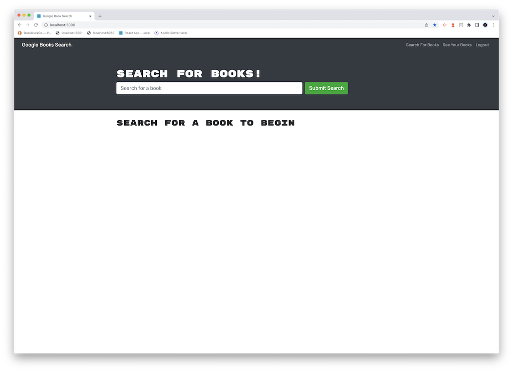
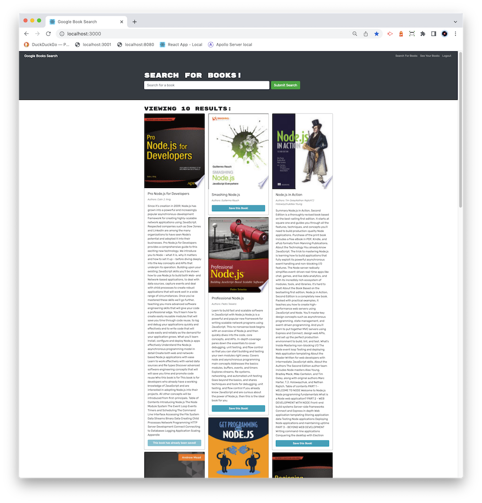
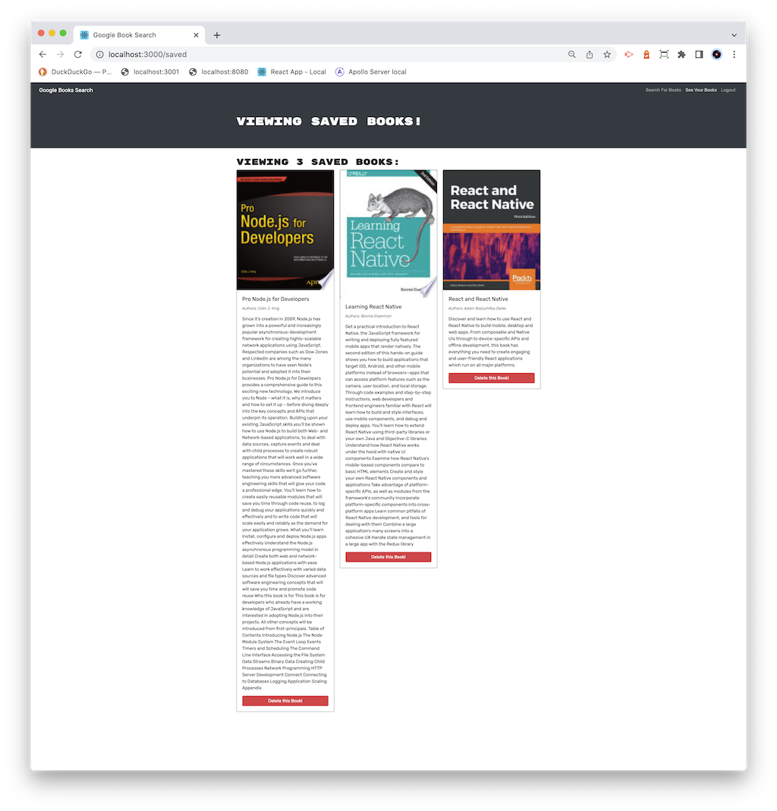

# 21-MERN-Book-Search-Engine

## Table of Contents-
- [MERN Book Search Engine](#MERN-book-search-engine)
  - [Table of Contents-](#table-of-contents-)
  - [Licensing](#licensing)
  - [Description](#description)
  - [Installation](#installation)
  - [Screenshots](#screenshots)
  - [Usage](#usage)
  - [Credits](#credits)
  - [Contributing](#contributing)
  - [Testing](#testing)
  - [Additional Info](#additional-info)

## Licensing

Link: [MIT License](https://opensource.org/licenses/MIT)

## Description

This is a MERN stack (MongoDB, Express.js, React.js, Node.js) application that searches Google Books for a given book title, then displays the results. It has a user login function that then provides a method to save desired book titles from the search results to the logged in user's account. The internal database API functions are provided through a GraphQL API using Apollo Server. 

## Installation

No installation is required, application is hosted on Heroku:

[https://blooming-escarpment-22398.herokuapp.com/](https://blooming-escarpment-22398.herokuapp.com/)

## Screenshots

## Usage

The application is hosted on Heroku, click on this link: 

[https://blooming-escarpment-22398.herokuapp.com/](https://blooming-escarpment-22398.herokuapp.com/)

## Credits

[React.js](https://reactjs.org/) - A JavaScript library for building user interfaces

[Apollo Client](https://www.apollographql.com/apollo-client) - A framework for binding data to your UI with GraphQL.

## Contributing

  [Contributor Covenant](https://www.contributor-covenant.org/)

## Testing

  No testing is provided.

## Additional Info

- Github: [cliff-rosenberg](https://github.com/cliff-rosenberg)
- Email: cliff459 AT icloud.com